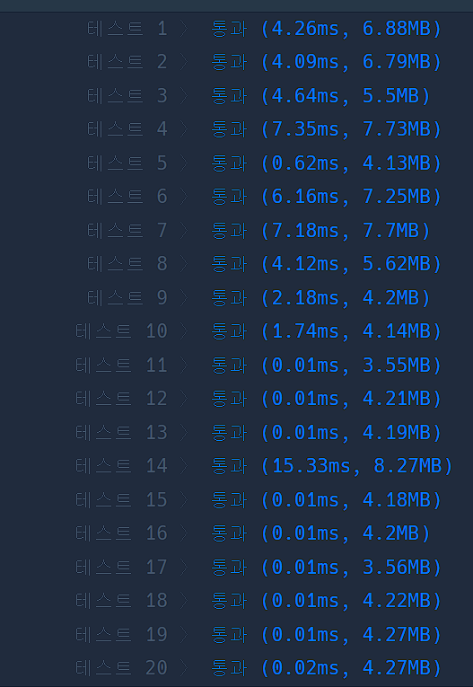

# 문제 풀면서 찾은 내용들

## 134240 strings.Builder/WriteString vs str + str

- 

- 

- 속도 차이 무엇....

- JAVA에서 String Builder가 더 빠른 이유는 문자열 객체를 새로 생성하지 않아서 라는데 GO도 비슷한 이유로 결국 + 연산을 하면 기존 문자열을 복사해서 새로 생성하면서 느려지는 결과가 생기는 듯 하다.
